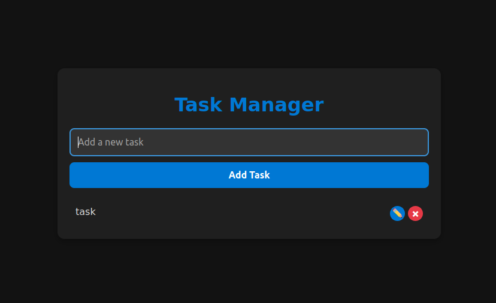

# Task Manager App

## Overview

The **Task Manager App** is a simple yet effective to-do list application built with **React** and **Firebase**. This app allows users to add, edit, and delete tasks in real-time, leveraging Firebase Firestore for cloud-based storage and live updates.

## Features

- **Add Task**: Add a new task to the list.
- **Edit Task**: Modify existing tasks.
- **Delete Task**: Remove tasks from the list.
- **Real-time Sync**: Tasks are synced across all devices in real-time using Firestore's real-time listeners.

## Technologies Used

- **React**: JavaScript library for building user interfaces.
- **Firebase**: Backend platform used for authentication and database services.
- **Firebase Firestore**: Cloud-based NoSQL database for storing tasks.

## Installation

### Prerequisites

1. **Node.js** and **npm** should be installed. You can download them from [here](https://nodejs.org/).

2. **Firebase Account**: Set up a Firebase project and get the configuration details for the Firestore database.

### Steps to Run the App Locally

1. Clone the repository:
   ```bash
   git clone <repository-url>
   cd <project-folder>
   ```

2. Install the required dependencies:
   ```bash
   npm install
   ```

3. Create a `.env` file in the root of the project and add your Firebase configuration like this:
   ```bash
   REACT_APP_API_KEY=<your-api-key>
   REACT_APP_AUTH_DOMAIN=<your-auth-domain>
   REACT_APP_PROJECT_ID=<your-project-id>
   REACT_APP_STORAGE_BUCKET=<your-storage-bucket>
   REACT_APP_MESSAGING_SENDER_ID=<your-messaging-sender-id>
   REACT_APP_APP_ID=<your-app-id>
   REACT_APP_MEASUREMENT_ID=<your-measurement-id>
   ```

4. Start the development server:
   ```bash
   npm start
   ```

   Your app should now be running on `http://localhost:3000`.

## Project Structure

Here's an overview of the main structure of the project:

```
/TaskManager
├── /public
│   └── index.html
├── /src
│   ├── /components
│   │   └── TaskManager.js
│   ├── /firebase.js
│   ├── App.js
│   ├── styles.css
│   ├── index.js
├── .env
├── package.json
└── README.md
```

### Key Files and Folders

- **`/components/TaskManager.js`**: Contains the main logic for adding, editing, and deleting tasks.
- **`/firebase.js`**: Contains the Firebase initialization and Firestore configuration.
- **`App.js`**: The root component that renders `TaskManager`.
- **`styles.css`**: Styles for the app, including dark theme and task list styling.
- **`.env`**: Environment variables for Firebase configuration.
- **`index.js`**: Entry point of the app.

## How It Works

### 1. **Adding Tasks**
   - The user can type a new task in the input field and click "Add Task" to save it in Firebase Firestore.
   - The task is automatically added to the list and reflected across all devices using Firestore's real-time listener.

### 2. **Editing Tasks**
   - To edit a task, click on the edit (✏️) button next to the task. The task will turn into an editable input field.
   - Once the user makes the changes, they can click "Save" to update the task in the Firestore database.

### 3. **Deleting Tasks**
   - The delete button (represented by a red "×") next to each task allows the user to remove the task from the list.

### 4. **Real-time Updates**
   - The tasks are fetched in real-time using Firestore's `onSnapshot` listener. Any changes (add, edit, delete) made to the tasks will automatically update across all users.

## Screenshots

### App View


## Issues and Future Improvements

- **Authentication**: Add Firebase Authentication for user login to make tasks user-specific.
- **Task Prioritization**: Allow users to set task priorities (e.g., high, medium, low).
- **Task Deadlines**: Add functionality for setting deadlines and reminders.
- **Mobile Responsiveness**: Improve mobile layout for better user experience.

## License

This project is licensed under the MIT License - see the [LICENSE](LICENSE) file for details.